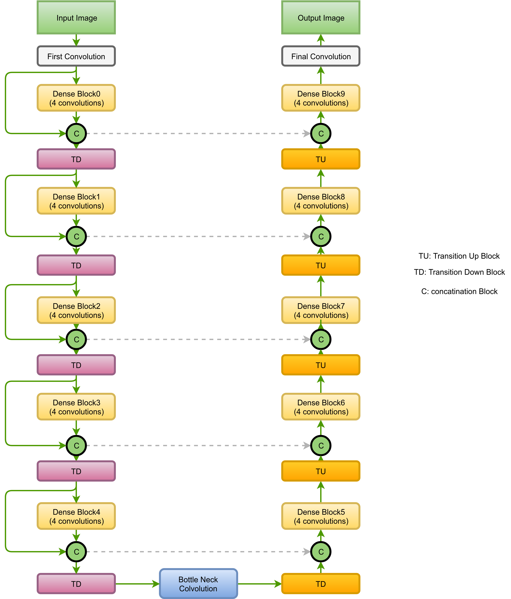
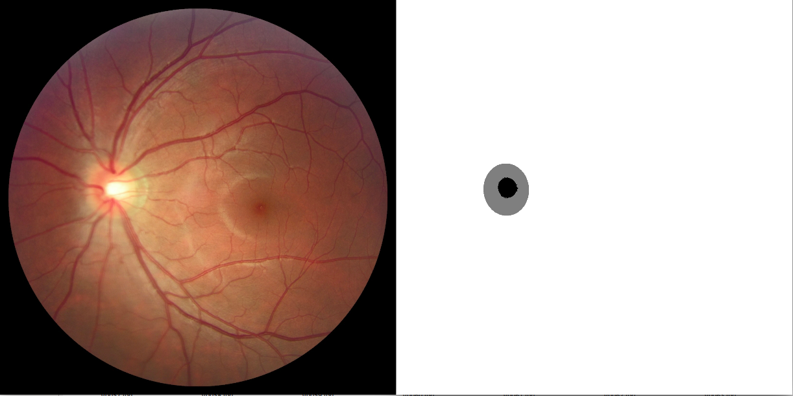

# Optic-Disk-Cup-Segmentation

## Introduction

This repository contains the implementation of convolutional neural network for optic disk and cup segmentation from given fundus images

## Preprocesing

Images were cropped to nearest square size and re-sized to a dimension of (512, 512). The different lighting conditions and intensity variations among images across various databases were circumvented by perform-ing normalization of the histogram using Contrast Limited Adaptive HistogramEqualization (CLAHE). 2 different images were generated by varying parameters such as clip value & window level while performing CLAHE. Along with CLAHE, spatial co-ordinates information were also provided to thenetwork. This additional information aided in learning relative features (i.e. disklocation with respect to fovea)

## Network Architecture

57 layered deep network was used for segmentation of optic disk and cup. Network architecture is illustrated in figure below...

## Results

### Model predictions

Mask generation used for reducing false positives predicted by network...

Image on left shows raw data and image on left shows model predictions...

## How to use?

~~~~

git clone https://github.com/koriavinash1/Optic-Disk-Cup-Segmentation.git
cd Optic-Disk-Cup-Segmentation
pip install -r requirements.txt

~~~~

## Folder structure

> ./src consists all source codes

> > ./src/segmentation code for all segmentation work

> > ./src/classification code for glaucoma screening : TODO

> > Tune parameters and run Main.py for executing task

If any comments or issues, pull requests/issues are Welcomed....

Thankyou

### Contact 

* Avinash Kori (avinashgkori@smail.iitm.ac.in)

